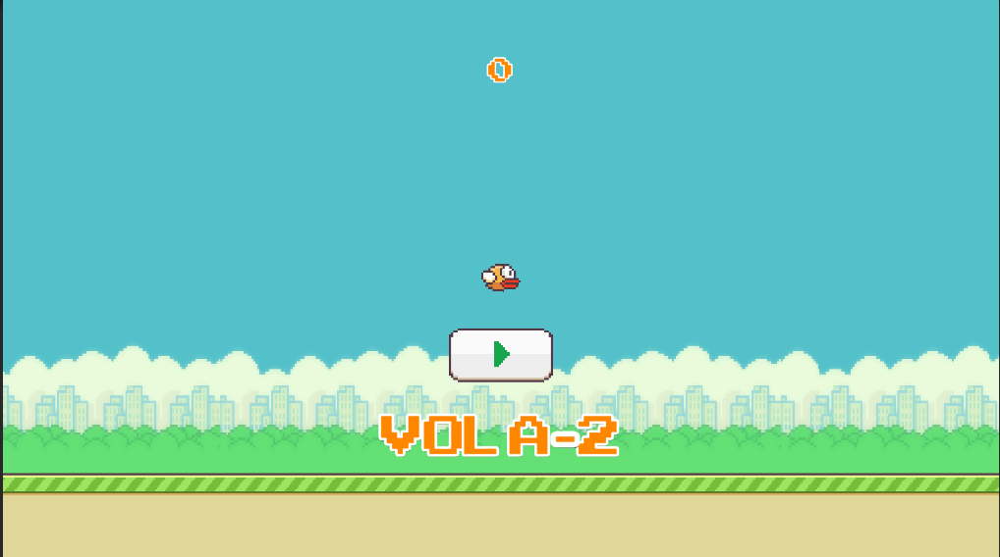
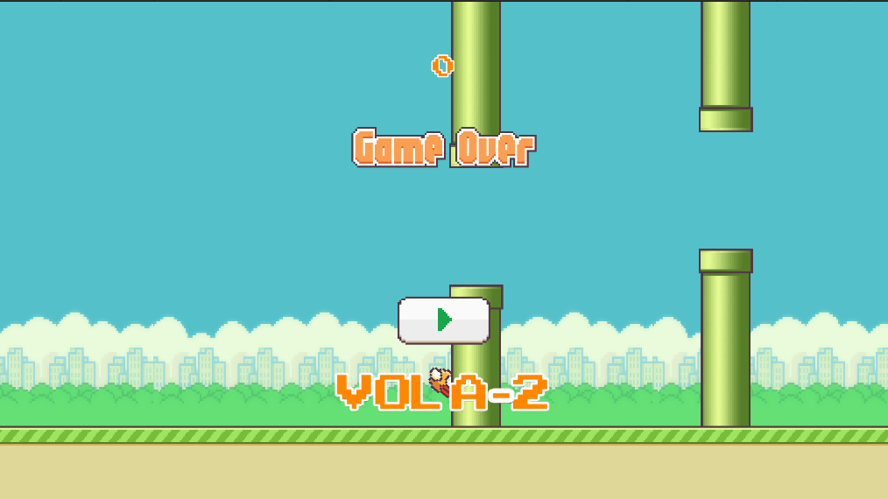
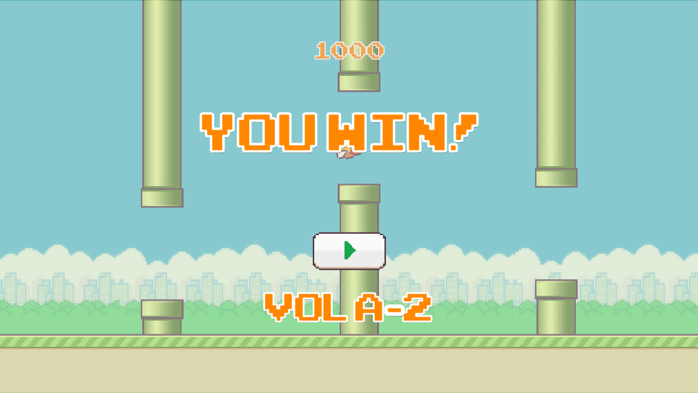

# Vola2-Unity

Brief project description.

## Game Idea
The game is based on a simple yet addictive concept of navigating through obstacles. The player has control over a flying character, and the goal is to successfully navigate through gaps between approaching obstacles. This concept was inspired by the popular game "Flappy Bird".

## Game Proposal
The proposal for this game is to provide a gameplay experience that is easy to understand but challenging to master. It requires quick reflexes, precision, and patience from the player. The increasing score and the possibility of beating the high score serve as strong incentives to keep playing.

## Screenshots

*Image 1. Game Start*

*Image 2. Player State "Fly" and Game Over*

*Image 3. Game Over at 1000 Points*

## How to Use the Project

1. Clone or download the project to your computer.
2. Open Unity and select "Open Project".
3. Navigate to the project folder and select the main folder.
4. Wait for Unity to import all the assets and project configurations.
5. Once imported, select the main game scene.
6. Click the play button to start the game.

## Tutorial Reference

This project is based on the tutorial "How to make Flappy Bird in Unity (Complete Tutorial)" from the YouTube channel "Zigurous". You can find the tutorial [here](https://www.youtube.com/watch?v=ihvBiJ1oC9U).

